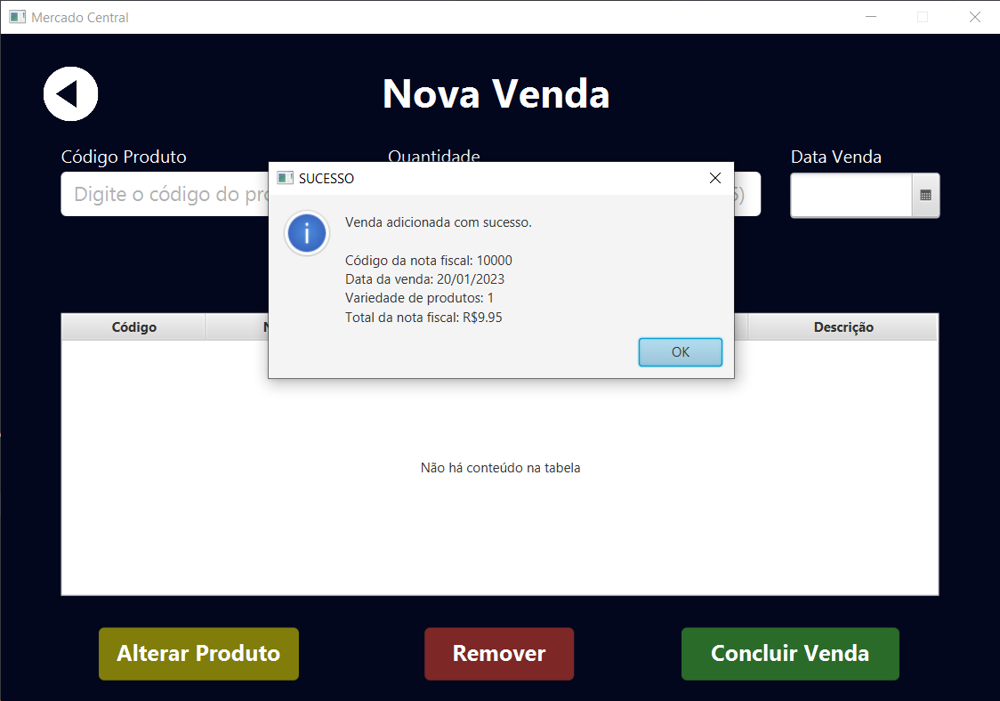
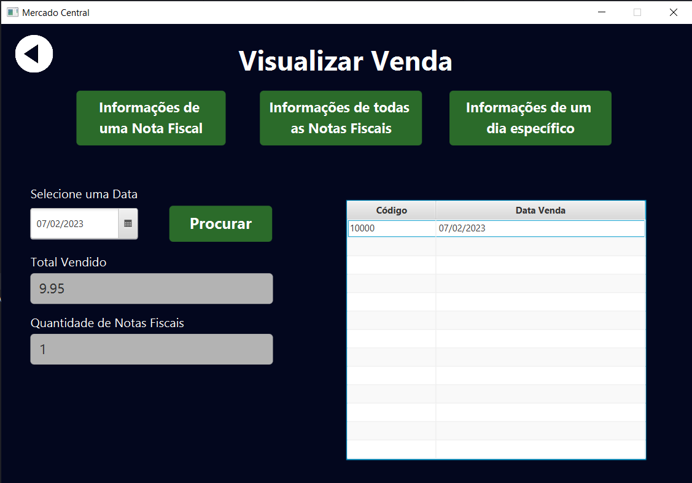

# Universidade Federal do Pampa - Unipampa
## Engenharia de Software - 2º Semestre

### Disciplina de Programação Orientada a Objetos
### Atividade Prática em Grupo 3 (AG3) 

**PROPOSTA:**

A atividade em grupo 3 aborda os seguintes assuntos: classes, objetos, associações, herança,
polimorfismo, interface, interface gráfica e tratamento de exceções.

**INTEGRANTES:**
* [Mateus Coelho Vitória](https://github.com/M4t3usC0)
* [Mauricio Lamberti da Silva Beutler](https://github.com/Beutler28)  
* [Ricardo Luiz Hentges Costa](https://github.com/ricardolhc)
* [Tales Schifelbein Soares](https://github.com/talessoares) 

**ENUNCIADO:**
Propõem-se o desenvolvimento de um sistema destinado ao gerenciamento de estoque de
minimercados, fruteiras e padarias. O software desenvolvido deverá estar de acordo com os
seguintes requisitos e especificações.
1. O software manipula produtos, onde cada produto deve apresentar, no mínimo, os seguintes
dados: código, nome, descrição, quantidade e preço. Existem duas grande categorias de
produtos: aqueles que são vendidos por unidade e aqueles vendidos por quilo. Nos
produtos vendidos por unidades, o atributo quantidade deve ser do tipo inteiro. Já nos
produtos vendidos por quilo, o atributo quantidade deve ser do tipo ponto flutuante.
Independente da categoria do produto, o atributo código deve ser único.
2. A coleção de todos os produtos em estoque, assim como os métodos que manipulam essa
coleção devem ser implementados por uma classe A de processamento que implementa a
interface IProdutos (download da interface no Moodle).
3. O software manipula também notas fiscais, onde cada nota fiscal deve apresentar, no
mínimo, os seguintes dados: código, data e relação de itens, onde cada item é composto
por um produto e a quantidade vendida.
4. A coleção de todas as notas fiscais, assim como os métodos que manipulam essa coleção
devem ser implementados por uma classe B de processamento que implementa a interface
INotasFiscais (download da interface no Moodle).
5. A interação com o usuário deve ocorrer através de interfaces gráficas. Importante: ela deve
permitir que os produtos sejam cadastrados, consultados, alterados ou excluídos e que as
notas fiscais sejam criadas, consultadas e alteradas, além de permitir saber o total vendido
em um determinado dia.

<b>Cabe ressaltar que A e B são nomes fictícios de classes e devem ser substituídos por
nome de classes adequados ao comportamento das mesmas.</b>

<b>AVALIAÇÃO:</b>

O AG3 vale 10 pontos e tem peso igual a 25% na nota final da disciplina. Serão avaliados
somente trabalhos que forem apresentados.

Pontuação:
Classes referentes a produto (unidade e quilo) e nota fiscal [1 ponto]

Classe referente a coleção de produtos [1 ponto]

Classe referente à coleção de notas fiscais [1 ponto]

Interface com o usuário que permita o controle do estoque [2 pontos]

Interface com o usuário que permita o controle de notas fiscais [2 pontos]

Tratamento de exceções [2 pontos]

Documentação Javadoc [1 ponto]

<b>Todo o sistema deve observar os conceitos da orientação a objetos.</b>

### Screenshots do projeto finalizado

**Adicionando produto** 

**Visualizar informações completas de todos os produtos**

**Nova venda**

**Venda realizada**

**Alterar venda**

**Visualização informações de um dia específico**

